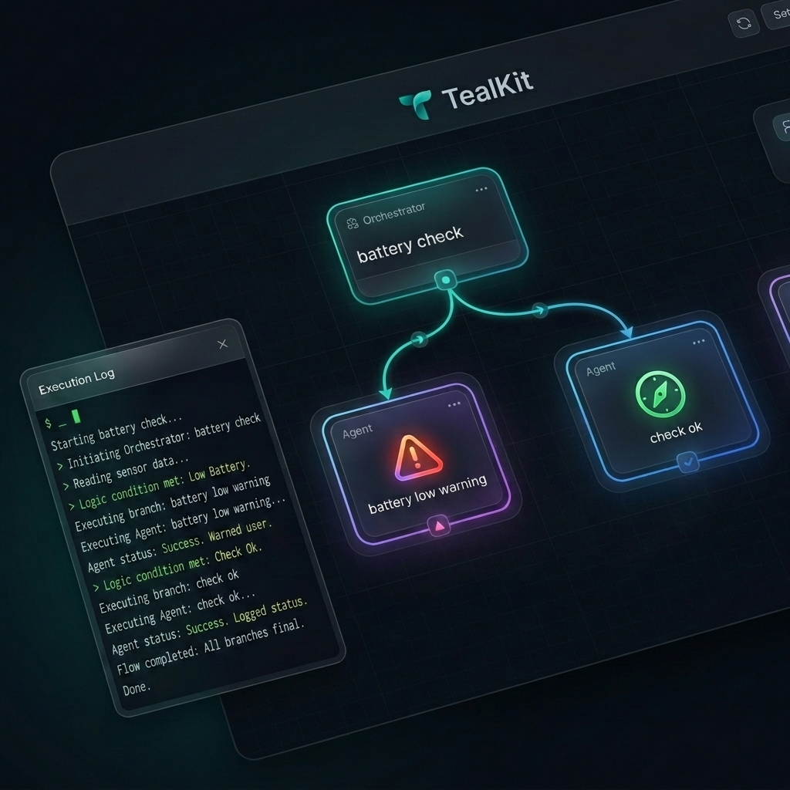
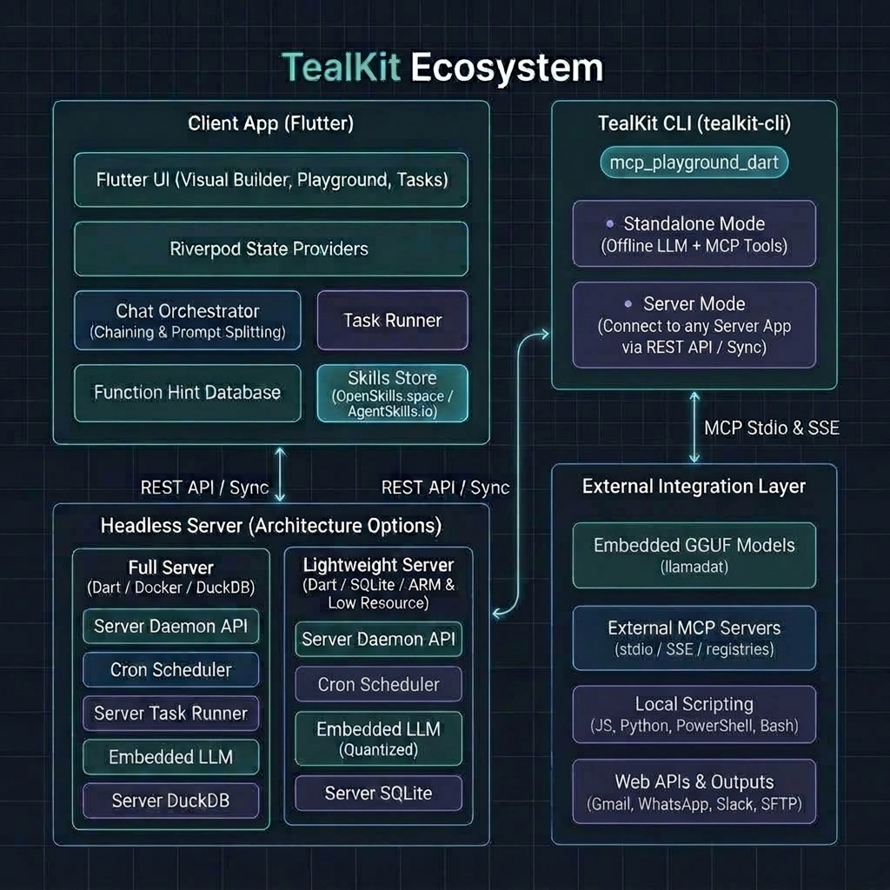
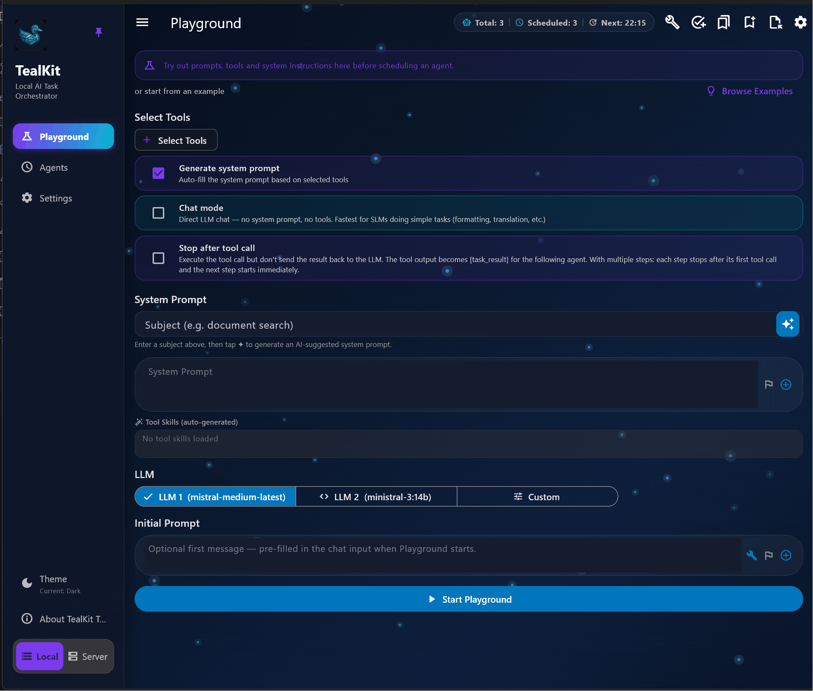

# 🐦‍⬛ TealKit
### The Zero-Config Alternative to OpenClaw.
[**Privacy first**](security_privacy.md), agentic AI Platform for Mobile & Desktop

For examples of what is possible with TealKit, see [USAGE_EXAMPLES.md](USAGE_EXAMPLES.md).
For release notes see [release_notes.md](release_notes.md).

> **💡 Behind the Project**
> 
> After four decades of building software, the shift toward AI workflows represents an exciting new frontier. TealKit serves as both my personal sandbox and a continuous learning platform for exploring this new technological era

**TealKit** turns your phone and computer into a powerful agentic AI platform with autonomous workflows, built-in tools, and unlimited extensibility. Write your own tools in **JavaScript, Python, PowerShell, or Bash** — or import and connect any MCP server — and let the AI use them autonomously. Provider-independent, fully customizable, and designed for privacy. 
TealKit is completely free. All features are available to every user with no trial, no subscription, and no in-app purchase.

[**English User Guide**](https://lschaffer.github.io/tealkit/guide/) | [**Deutsches Handbuch**](https://lschaffer.github.io/tealkit/guide/de/) | [**Privacy Policy**](https://lschaffer.github.io/tealkit/)

---

## 🗺️ High-Level System Architecture

TealKit is designed as a hybrid ecosystem: a Flutter-based client app that runs locally on user devices, and a headless Dart server daemon that can run 24/7 in cloud/local VPS Docker containers.

---

## 🎥 Latest Videos

* **TealKit Playground: Importing Hermes Agent Skills & Auto-Detecting Missing Tools**
  https://youtu.be/EUQEFbf4UT0

* **Tealkit Multi-Agent System in Action — Full Demo on ARM64 Mac Mini M4 Pro**
  https://youtu.be/i28xrFum3KM

---

## 🆕 What's New

* **Agentic Skill Interoperability (v1.4.6)** — Export and import workflows as standardized, compliant skills under the `agentskills.io` specification. Workflows containing custom Python scripts are automatically packaged as `.zip` files containing `[workflow-name]/SKILL.md` and script files under `scripts/` (e.g. `main.py` and `requirements.txt`). On import, the ZIP is parsed, and any custom scripts are restored to your local registry. Compatible with active local or remote server databases.
* **Playground Auto-Skills** — Saving and testing workflows in the Playground now automatically compiles and saves them as compliant skills when converted to workflows. Includes automatic duplicate overwrite warnings and filename customization dialogs.
* **Workflow Visual Builder** — An interactive 2D flowchart canvas with zoom, pan, and auto-centering to easily design, configure, and visualize workflow orchestrations.
* **Workflow Orchestration** — Build complex multi-workflow pipelines and workflows with sequential or conditional routing rules.
* **Seeded Default Python Tools** — TealKit now automatically seeds **3 default Python tools** (`csv_analyzer`, `json_query`, and `text_classify`) on first run in both Desktop and Serverless/Server modes, giving you instant data profiling, querying, and classification capabilities using stdlib-only scripts with no extra setup required.
* **Multi-Modal Toggles & Dynamic Overrides** — Easily switch between multi-modal and pure text models in settings (LLM 1, LLM 2, Embedded, Playground, and Task Editor). A new manual toggle allows overriding detected defaults to control whether the attachment button is displayed in the chat interface.
* **Model Prefetching & Autocomplete** — Query and prefetch the list of actual available models directly from Ollama, OpenAI, OpenAI-compatible, and Mistral endpoints, populating autocomplete lists inside settings dynamically.
* **Improved Attachment Handling** — Intelligent pre-processing automatically extracts text content (including PDF/text parsing) and appends/inlines it directly into the prompt context for models operating in text-only mode.
* **macOS Direct Download (Unsandboxed)** — A new direct download installer (`TealKit-macos-direct.dmg`) is now available for macOS. This version runs with the macOS App Sandbox disabled, allowing TealKit to access your host's PATH and run local Python (`uv`, `pip`) and Node.js (`npm`, `npx`) MCP servers directly. The standard Mac App Store version remains sandboxed for maximum security; if you attempt to configure local tools in sandboxed mode, the app will automatically detect the sandbox restriction and provide a link to get the direct version. See the [macOS Direct Download Guide](macos_direct_download.md) for download links and installation instructions.
* **Install Any MCP Server** — Add any Node.js or Python MCP server not listed in the registries (GitHub, Glama, PulseMCP, Smithery) using a simple guided dialog.
* **Auto-Generated function hints** — TealKit now automatically generates a **function hint** for every MCP tool — a concise, model-optimised usage hint that tells the LLM exactly how and when to call that tool. function hints are **size-aware**: a compact one-liner is generated for small/embedded models (≤ 7 B parameters) and a richer, detailed description for larger models; the right variant is selected at runtime based on your active LLM. Tap the **✨ (sparkle)** icon on any MCP server card to auto-generate function hints via the LLM, or tap the **🧠 (brain)** icon to open the per-function hint editor and fine-tune them manually. A new **👁️ Preview Full Prompt** button (eye icon) in every workflow editor shows the complete effective system prompt — including all injected function hints — in an editable dialog; tap **Apply to prompt** to write changes back to the workflow.

* **Multi-step Prompt Editor** — prompt splitting is now a first-class visual editor everywhere a prompt is entered: Playground, workflow task editor, and Chat input. Each step appears as its own text box with a "Step N" divider. A per-step tool selector lets you choose exactly which tools are available for that step. Tools are grouped by toolset (Toolbox, Gmail, Weather MCP, etc.) — each tool can be checked or unchecked individually, or you can tap **All** on a group to enable every tool in it at once. **Select all** / **None** buttons act across all groups. Each step therefore exposes only the exact tools it needs, keeping the model's context focused. Add or remove steps with one tap — no need to type the `++#++` separator manually. When a step runs with no tools, its LLM text response is automatically captured and forwarded as `${tool_result}` to the next step, so fetch → format → visualise pipelines work seamlessly even when the middle step is a pure reformatter.

  See the [decision guide below](#-prompt-splitting-vs-workflow-chaining) on when to use Prompt Splitting vs workflow Chaining.

* **Server Mode** — run the TealKit Server as a headless daemon on any always-on Linux device: an NVIDIA Jetson Nano Super, a Mac Mini M4 Pro, a Raspberry Pi, a home-lab VM, or a cheap VPS. Your phone or desktop app connects remotely via a secure API key while all scheduled tasks, automations, and pipelines run 24/7 without the app being open. The server talks to any LLM on a separate GPU-capable machine over the local network — keeps your data home and your compute yours. Ideal for Home Assistant control, server monitoring, daily report generation, or any long-running headless pipeline. A ready-to-deploy, security-hardened Docker image and a one-command setup script will be available to download and install directly on your local device — no registry login required, just download, `docker load`, and run.
* **Embedded (on-device) models** — download and run GGUF models directly on your device with zero cloud dependency, and now also **fully supported inside the TealKit Server app**. Browse the HuggingFace catalog or add any GGUF URL, select CPU / Partial GPU / Full GPU offloading per model, and run inference without an API key or internet connection. Best suited for formatting, translation, and summarisation in **Chat Mode**; tool calling requires a model trained for function calling **and** sufficient GPU VRAM to load it fully. Go to *Settings → Embedded Models* to get started.
* **Advanced LLM Parameters** — Top-k, top-p, repeat penalty and seed are now configurable in the global LLM Settings dialog (both LLM 1 and LLM 2 tabs) and in the per-task editor. Leave any field blank to use the provider's built-in default. Useful for fine-tuning output diversity and reproducibility — especially with local Ollama models where these parameters have a direct impact on generation quality.
* **Chat Mode** — A new toggle in Playground and workflow settings (Basic tab) that bypasses the system prompt and all tools, forwarding your message directly to the LLM. Perfect for SLMs doing pure text work — translations, formatting, summarisation — where tool overhead adds latency without benefit.
* **workflow Chaining (conditional & unconditional)** — Chain workflows with or without an LLM-evaluated condition. Unconditional chaining always passes the result to the next workflow. Conditional chaining evaluates an expression and routes to different follow-up workflows depending on the outcome. The triggering workflow's output is injected at the `${task_result}` placeholder in the chained workflow's prompt.
* **Stop After Tool Call** — New option in workflow and Playground settings. When enabled the workflow runs exactly one tool call, then stops — handing the raw tool output directly as `${task_result}` to the next chained workflow without any further LLM processing. Ideal for data-extraction pipelines where you want unmodified tool output to flow into a downstream workflow.

---

## 📸 Desktop Mode Screenshots

### 🎮 Playground
The central AI Playground — test prompts, switch between LLM 1 / LLM 2 and embedded models, and iterate before saving as an automated workflow.

### ✏️ Workflow Editor

| workflows | |
|---|---|
| **workflows** — Browse workflow in local mode or headless mode workflows in the connected server |  |
| **workflow History** — Review past runs and outputs |  |
| **Manual Execution** — Trigger workflows on-demand with custom input |  |

| Workflow Editor Tabs | |
|---|---|
| **Tools** — Per-step tool selector, grouped by toolset (Toolbox, Gmail, MCP any registered or in app created MCP server) |  |
| **Prompts** — Multi-step visual prompt editor with step-by-step tool selectors, stop after tool call, chat mode, any tool can be enabled/disabled from the preselected toolsets |  |
| **Chaining** — Conditional or unconditional workflow chaining with `${task_result}` injection |  |
| **Schedule** — Cron-based scheduling for fully autonomous background execution |  |
| **LLM** — Use preconfigured LLM1, LLM2 or configure workflow based from any provider including embedded models. Advanced LLM parameters (top-k, top-p, repeat penalty, seed) per task |  |
| **Output** — Multi-channel output |  |

### ⚙️ Settings
Comprehensive settings panels for every aspect of TealKit.

| Settings Panels | |
|---|---|
| **General Settings** |  |
| **Data Sources** — Configure DuckDB/RAG document sources, configure web site search API and website crawl (inbuilt tools) |  |
| **MCP Registry** — Browse GitHub, Glama, Smithery, PulseMCP registries |  |
| **Server Mode — LLM & Embedded** — LLM configuration for server-side workflows |  |
| **Server Mode — MCP** — MCP server connections in server mode |  |

### workflow orchestration & visual editor

| Workflow Orchestration & Visual Editor | |
|---|---|
| **Visual Builder (Desktop)** — Multi-workflow pipeline with conditional routing rules |  |
| **Visual Builder (Desktop)** — Multi-workflow pipeline live execution|  |
| **Workflow List (Mobile)** — Overview of configured workflows on mobile devices |  |
| **Workflow Routing (Mobile)** — Setup transitions and conditional routes on mobile devices |  |
| **Visual Builder (Mobile)** — Flowchart visualization of the multi-workflow pipelines |  |
| **Routing Conditions (Mobile)** — Configure precise conditional rules directly on the canvas |  |
---

## 🚀 Core Capabilities

### 🤖 AI Playground & Flexibility
* **Provider Independent:** Use leading providers like **Google Gemini, OpenAI GPT-5, Anthropic, and Mistral**.
* **🇪🇺 European Privacy & GDPR:** Data sovereignty matters. TealKit works fully with **Mistral AI** — a European provider headquartered in France that processes all data within the EU. Ideal for users and organisations where GDPR compliance is non-negotiable. Just enter your Mistral API key and your prompts never leave European infrastructure.
* **Small Language Models (SLM):** Not every task needs a powerful cloud model. Run lightweight SLMs on your own hardware with **Ollama**, **LM Studio**, or any OpenAI-compatible local endpoint — zero cloud costs, zero data sharing. Or use **Embedded (on-device) models** to download GGUF models directly inside TealKit and run them with no external server at all (*Settings → Embedded Models*). Mark a model as **SLM** in LLM Settings to get a compact, action-focused system prompt that forces the model to call tools immediately instead of explaining its plan. For pure text tasks (translation, formatting, summarisation) enable **Chat Mode** to skip all tools and system prompt overhead entirely — the fastest path from prompt to response for SLMs and embedded models alike. **Important:** Embedded models are most practical for text tasks; agentic tool calling requires a model explicitly trained for function calling **and** enough GPU VRAM (dedicated GPU such as Apple Silicon, Snapdragon 8 Elite, or a discrete GPU) to load the full model — without GPU acceleration, inference on a 3 B+ model can take minutes per response.
* **Dual-LLM Setup:** Configure a secondary LLM (LLM 2) — for example a fast SLM for code tasks — and switch between them directly in the **Playground** with the LLM 1 / LLM 2 selector. Every model behaves differently; use the Playground to compare prompts across models and find the best fit for each task before automating it.
* **Local Intelligence:** Support for **Ollama** models for 100% offline processing.
* **Full Customization:** Tweak model parameters per task and keep token costs predictable.
* **Chat-to-Task:** Test ideas in the chat interface before promoting them to automated tasks.
* **Auto System Prompt:** Select tools and TealKit automatically generates a tailored system prompt via AI — editable before you start.

### 🛠 Built-in AI function hints
* **Document Intelligence:** Local RAG using **DuckDB**. Index PDFs, Word, and Excel files for instant semantic search across your device.
* **Digital Office:** Deep integration with **Gmail**, **Google Calendar**, **Google Drive**, and universal IMAP/SMTP support.
* **Content & Visualization:** Generate files (TXT, PDF, Excel) and create **Mermaid** diagrams/flowcharts from any data.
* **Web Search & Indexing:** Perform live searches via **SerpApi** or **DuckDuckGo**, and crawl websites for local indexing.
* **Remote Management:** Manage servers via **SSH** on all platforms. On Desktop, generate and execute **Bash scripts** locally (Linux/macOS) or **PowerShell scripts** (Windows).

### ⚙️ Agentic Workflows & Automation
* **Autonomous Execution:** Schedule **cron-based** tasks that run in the background, even when the app is closed.
* **Multi-step Prompt Editor:** Use the visual step editor (available everywhere a prompt is entered — Playground, workflow task editor, Chat input, and Server Mode) to split a single task into sequential steps. Each step is a full LLM call. Per-step tool selectors let you choose exactly which tools each step can use — tools are grouped by toolset (Toolbox, Gmail, Weather MCP, etc.) and each can be toggled individually or all at once per group, so every step is exposed to only what it needs. `${tool_result}` injects the previous step's tool output or LLM response (when no tool was called) into the next step. Ideal for small and local models that benefit from single-purpose, focused micro-steps rather than long multi-goal prompts.
* **workflow Chaining:** Build multi-workflow pipelines — with or without conditions. Chain workflows unconditionally to always pass results forward, or add an LLM-evaluated condition (e.g., "If X is found, escalate, otherwise archive"). The triggering workflow's output is available as `${task_result}` in the chained workflow's prompt. Combine with **Stop After Tool Call** to pass raw tool output (e.g., SSH command result, web scrape) directly to the next workflow without LLM reformatting.
* **Multi-Channel Output:** Save results to local storage, or send them via **Email, Slack, or WhatsApp** (with attachments).

---

## 🔀 Prompt Splitting vs workflow Chaining

| | Prompt Splitting (`++#++`) | workflow Chaining |
|---|---|---|
| **Setup** | One workflow, one prompt field — visual step editor adds/removes steps with per-step tool mode controls | Multiple separate workflows |
| **Model per step** | Same model for all steps | Different model per workflow |
| **Conditional branching** | No | Yes (LLM-evaluated condition) |
| **Scheduling** | One schedule, one task | Each workflow can have its own schedule |
| **`${tool_result}` / `${task_result}`** | Injects previous step's raw tool output | Injects previous workflow's full output |
| **Best for** | Small/local models needing focused single-step prompts; sequential fetch → format → summarise within one workflow | Complex cross-model pipelines; conditional routing; different output channels per step; large workflows where each workflow runs on its own schedule |

---

## 💡 Real-World Examples

### 📱 All Platforms (Mobile + Desktop)

| Scenario | Tools | Overview |
| :--- | :---: | :--- |
| **The Disk Guardian** | SSH + Email | Two chained workflows monitor your server autonomously. workflow 1 runs a remote shell script to check disk usage on `/dev/sda1`; if usage exceeds the threshold, it triggers workflow 2 — which generates a styled HTML "Disk Warning" email and sends it automatically. [▶ Watch demo](https://youtube.com/shorts/WVhGGEkrO8Q) |
| **The Document Oracle** | RAG / DuckDB | Index local technical documentation folders into an on-device DuckDB vector store. Ask a semantic question to find documents about a specific sensor — results returned as an HTML table with document name, line, and excerpt. Then extract detailed information from any result as structured Markdown. [▶ Watch demo](https://youtu.be/Kd5ZGAA1Ufg) |
| **The File Monitor** | SSH + Ollama | The SLM generates a shell script on the fly to check for newly uploaded files in a target folder within the last N hours. The script is validated in the playground, packaged into a scheduled workflow, and runs automatically against a remote Linux server. [▶ Watch demo](https://youtu.be/U16z-iDifVU) |
| **The Assistant** | Gmail + Calendar | Searches Gmail for mobile provider invoices from the current year, summarizes the costs, and automatically creates a Google Calendar entry if the total exceeds a set threshold. [▶ Watch demo](https://youtube.com/shorts/aFYEG2Xb3aY) |
| **The Travel Planner** | Weather + Web Search | Checks the 2-day weather forecast for a destination. If the average temperature exceeds 12°C, the workflow searches for cheap flight and train tickets — combining forecast data with live web results in one prompt. [▶ Watch demo](https://youtube.com/shorts/hArRzLPjHTM) |
| **The Smart Home Assistant** | Weather + Home Assistant MCP | Fetches the 12-hour weather forecast for your location. If the average temperature is above 14°C, sets the Ecobee target range to 18–22°C; otherwise 21–23°C. Runs hourly to keep your thermostat automatically in sync with outdoor conditions. [▶ Watch demo](https://youtu.be/9skCLFxj1w8) |
| **The Cost Analyst** | IMAP + Excel | Searches email for this year's invoices from a mobile provider, extracts invoice line items automatically, and stores structured results in an Excel file. Runs once per month on schedule — then sends the current Excel balance by email. [▶ Watch demo](https://youtube.com/shorts/lznwpNNrJqE?feature=share) |
| **The Fare Scout** | SerpAPI + Email | Uses web search tools via SerpAPI to find train tickets to Trieste for next weekend. Extracts and compares relevant price options, then generates a clean formatted HTML summary report. Applies a threshold rule — sends the email only if the price is below your configured budget. [▶ Watch demo](https://youtu.be/YrWvgUMoers) |
| **The News Briefing** | Server Mode + MCP Registry + Email | An Android phone connects to a headless server on a cloud Linux VM (also works on Raspberry Pi, Jetson, Mac mini, or any local device). From the mobile UI, browse the GitHub MCP tool registry, download a Python website-fetcher tool, and register it into the server — no SSH, no terminal. Create an workflow that fetches today's top headlines from orf.at, parses them, and delivers the result by email. Full daily news briefing, controlled from your phone. [▶ Watch demo](https://youtube.com/shorts/R6D8wIStIsU?feature=share) |
| **The CPU Reporter** | SSH + Embedded + SFTP | Three chained workflows running on embedded (phi-4-instruct Q6 on Android) and a local SLM (Ministral-3b via Ollama on Mac Mini M4 Pro) build a live server report with no cloud AI. workflow 1 runs a remote `cpu_usage` shell script over SSH for 20 seconds, collecting timestamped CPU samples. workflow 2 formats the raw output as a structured JSON list. workflow 3 generates an HTML line chart from the dataset and uploads the files to the Linux server via SFTP. [▶ Watch demo](https://youtube.com/shorts/Nlw16DYAfhI) |
| **Tealkit Headless Mode: Mobile UI + Private Cloud Server + Remote MCP Automation** | Server Mode + Remote MCP + SFTP | TealKit Server runs in a private Linux mini-cloud behind a proxy while the Android app acts as the UI. A third-party remote MCP server provides weather sensor and battery data; a mobile-configured workflow collects daily battery levels and uploads reports to SFTP. This demonstrates private, self-hosted automation with distributed MCP integration and a mobile-first control flow. [▶ Watch demo](https://youtu.be/AzwQqqbGTLo) |

### 🖥 Desktop Only

#### 🐙 GitHub Integration

| Scenario | Tools | The Workflow |
| :--- | :---: | :--- |
| **The GitHub Reporter** | GitHub MCP + FTP | Install the Node.js GitHub MCP server from GitHub in TealKit with your access token. Create a task: *"Scan this repository for changes since yesterday, write a formatted summary to a text file, and upload it to an FTP server"*, scheduled **daily at 08:00**. |

#### 🪟 Windows Administration

| Scenario | Tools | The Workflow |
| :--- | :---: | :--- |
| **The Downloads Janitor** | PowerShell + Email | **Step 1 — Script:** In the **PowerShell Script Library**, generate a script named `old_files` with prompt *"Accept a parameter DaysOld. Scan the current user's Downloads folder for files older than DaysOld days. Output each file as: path \| modified date \| size in KB. Sort ascending by modified date."* **Step 2 — Following workflow:** Create an workflow named `old_files_alert` with **Following workflow mode** enabled and prompt *"You receive a list of old files. Send an email with subject 'Old files in Downloads' and the list formatted as an HTML table."* **Step 3 — Main workflow:** Create a task using the **PowerShell** tool, prompt *"Call old_files 30. Format the output as a Markdown list."*, enable **workflow Chaining** with condition *"list count > 10"*, link to following workflow `old_files_alert`, scheduled **daily at 07:00**. |

---

## 🔌 Extensibility — Add Any function hint, Connect Any Service

TealKit is an **open agentic platform**: every capability not built-in can be added as a custom AI function hint or by connecting a third-party MCP server — no boilerplate, no backend required.

### Your Own AI function hints

| function hint Type | Platform | What You Can Do |
| :--- | :--- | :--- |
| **JavaScript** | All (Mobile + Desktop) | Write sandboxed custom function hints directly in the app — no server, no install needed. |
| **Bash / Shell Script** | Desktop — Linux & macOS | Generate and run shell scripts locally; stdout/stderr feed straight back into the workflow. |
| **PowerShell Script** | Desktop — Windows | Generate and execute PowerShell scripts for full Windows automation from a single prompt. |
| **Python MCP Server** | Desktop — all OS | Build complete MCP servers with the built-in editor, instant reload, and full library access. |

> **Syntax-highlighted code editor:** All script libraries (JS, Bash, Python, PowerShell) include a full-screen code editor with syntax highlighting and one-tap expand — making it easy to review, tweak, or copy generated scripts before saving.

### Connect to Existing MCP Servers

| Method | Platform | How It Works |
| :--- | :--- | :--- |
| **Import from GitHub** | Desktop | One-click install of any Node.js or Python MCP server straight from a GitHub repository URL. |
| **npm / PyPI Registries** | Desktop & Server Mode | Install any other MCP server package directly from npm or PyPI using a simple guided dialog. |
| **Glama** | All | Browse the Glama registry inside TealKit and connect any listed server with a single tap. |
| **Smithery** | All | Search the Smithery catalog directly from the app and register cloud-hosted MCP servers instantly. |
| **PulseMCP** | All | Discover servers from the PulseMCP directory and add them to your workflow's toolset in one step. |
| **Custom URL** | All | Paste any MCP server URL (SSE or HTTP) to connect private or self-hosted servers. |

**No TealKit Cloud.** Your private data, files, settings, and credentials remain in your device's secure storage. You choose the third-party providers you trust.

---

## 💻 Platforms

| Platform | |
| :--- | :--- |
| **Android** |  |
| **Windows** |  |
| **macOS** |  |
| **iOS** |  |
| **Linux** | - |

---

## ✅ Now Available — Fully Offline with Embedded Models

Run TealKit without any internet connection by loading a GGUF model directly on your device — no API key required. Browse the built-in **HuggingFace catalog**, paste any direct GGUF download URL, choose **CPU / Partial GPU / Full GPU** offloading per model, and chat entirely on-device.

Go to *Settings → On-device models* to download and activate a model. See the [**Embedded Models**](https://lschaffer.github.io/tealkit/guide/#embedded) section in the User Guide for hardware requirements and recommended models.

---

## 📖 Best Practices

See the [**Best Practices**](https://lschaffer.github.io/tealkit/guide/#best-practices) section in the User Guide for tips on reducing token costs, using the script wizards effectively, and choosing the right model for each task.

### 🖥 Multiple Server Instances for Mixed-Frequency workflows

If you run workflows on very different schedules — for example a **monitoring workflow that fires every few minutes** alongside workflows that run once a day or weekly — operate them on **separate TealKit Server instances** (separate Docker containers).

**Why this matters:**
- Each server instance owns its own **DuckDB database**. A high-frequency workflow writing metrics every few minutes will fragment and lock the database in ways that disrupt low-frequency workflows that need long, consistent read windows.
- A short-cycle workflow (interval < 10 min) keeps the inference engine and tool runtime warm continuously. Sharing those resources with a heavy daily pipeline causes unpredictable latency spikes and potential queue saturation.
- Isolating instances ensures a crashed or stuck high-frequency workflow cannot block a critical daily report or scheduled summary.

**Recommended split:**

| Instance | Typical workflows | Suggested schedule |
|---|---|---|
| **Server A — high-frequency** | System monitor, uptime checker, alert watchdog, live dashboard feed | Every 1 – 9 minutes |
| **Server B — low-frequency** | Daily digest, weekly report, scheduled backup, data sync | Hourly, daily, or weekly |

Each Docker container is fully independent — its own data volume, its own DuckDB state. **Implemented in the latest GUI App:** a built-in screen to configure and switch between multiple server instances directly from the app.

> **Tip:** Both instances can share the same Ollama / LM Studio / embedded-model endpoint if your compute host is separate. Only the TealKit Server process and its storage volume need to be duplicated — not the LLM itself.

---

## 🚀 Coming Soon

- **TealKit CLI (`tealkit-cli`)** — An independent command-line interface application to control and monitor any TealKit headless server remotely or locally.
- **Prebuilt Docker Images for ARM** — Native ARM64 Docker images optimized for Raspberry Pi 5 (HAT+) and Apple Silicon (Mac M4, M3, M2, M1).

---

## 🔒 Security & Privacy

See the dedicated [**Security & Privacy**](security_privacy.md) document for detailed information on:

- **🔑 Credential Storage** — how API keys, OAuth tokens, SSH keys, and passwords are encrypted and stored per platform (Android Keystore, iOS Keychain, Windows Credential Manager, DuckDB, etc.)
- **🕵️ What Leaves Your Device** — what data is sent to LLM providers and what never leaves the app
- **🖧 SSH Authentication Isolation** — how SSH connections are handled entirely in-process without exposing credentials to the AI model
- **🛡️ Security Best Practices** — MCP server trust guidelines, SSH least-privilege recommendations, workflow automation safety considerations, and vault backup tips

---
**Developed by [L. Schaffer](https://github.com/lschaffer)**